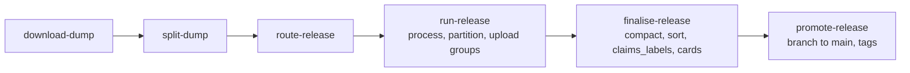

# wikidata-pq

wikidata-pq builds Wikidata into Parquet datasets on the Hugging Face Hub. It reads one of
Wikidata's weekly JSON dumps (a *release*, named by the dump's date), turns each kind of
data into a flat table, splits each table by language, sorts it by id, and publishes it
with a dataset card. Every step records its progress on disk, so an interrupted run
continues where it stopped.

## What it produces

Seven tables, each a dataset repo under [`permutans`](https://huggingface.co/permutans):

| Table | One row per | Split by |
|---|---|---|
| `labels` | entity and language: its name | language |
| `descriptions` | entity and language: its short description | language |
| `aliases` | entity, language and alias: its other names | language |
| `links` | entity and site: its page title on a Wikimedia site | site |
| `claims` | statement: property, value, rank, qualifiers, references | not split (`all`) |
| `claims_labels` | referenced property, item or unit, and language: its label | language |
| `entities` | entity: type, page id, title, last revision, modification time | not split (`all`) |

A release is published as two sets of these tables:

- `wikidata-{table}`: every entity except scholarly works.
- `wikidata-scholar-{table}`: the scholarly works (scholarly articles, theses, conference
  papers and 40 other classes; see [Dump and routing](reference/dump.md#scholarly-works)).

Each language (or site) is a folder of the repo and a subset of the dataset, so a user
downloads only the languages they want. Rows are sorted by id within each folder, so a
lookup by id reads only the row groups that can contain it. Each release is kept as a tag
of every repo; `main` holds the latest.

## How it runs

`just release {release} {previous}` runs everything after `route-release` in order, for
both sets. See [Build a release](guide/release.md).

## Where to read next

- [User guide](guide/index.md): running a release, watching it, and what to do when it
  stops.
- [Reference](reference/index.md): what each module does and why, in the order the data
  passes through them.
- [Changelog](changelog.md): what changed, by date.
- The repository's `docs/journal/` holds the development journal: investigations,
  measurements and decisions, by date. These pages describe the code as it is; the
  journal records how it got there.
