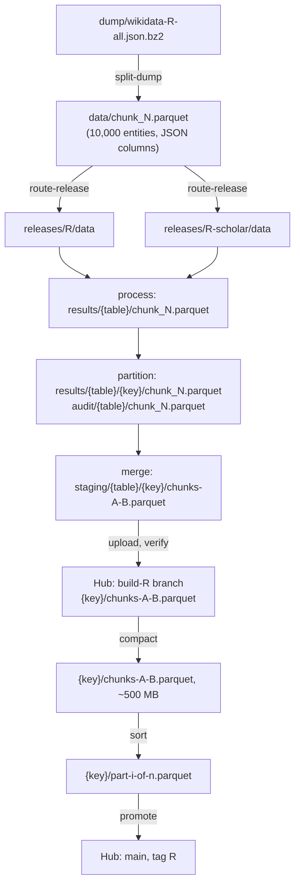

# Reference

One page per part of the package (`src/wikidata/`), in the order the data passes through
them. Each page says what the code does, the decisions behind it, and the files it reads
and writes. Each ends with the files it describes and their checksums at the time of
writing (see [About these docs](../about.md)).

## Code map

| Module | Page | Role |
|---|---|---|
| `config.py` | [Configuration](config.md) | environment variables, paths, tables, constants |
| `dump.py`, `scholarly.py` | [Dump and routing](dump.md) | download, split and route an official dump |
| `main.py` (`run`), `pool.py`, `state.py`, `initial.py` | [Run loop and state](run.md) | the chunk loop, worker processes, per-chunk state |
| `process.py` | [Processing](process.md) | a chunk's JSON to seven typed tables |
| `partitioning/` | [Partitioning](partitioning.md) | each table split by language, with audit sidecars |
| `push/` | [Push](push.md) | groups of chunks merged, uploaded and verified |
| `main.py` (`finalise`) | [Finalise](finalise.md) | the order of the finalise stages |
| `compact.py` | [Compaction](compact.md) | group files rewritten into ~500 MB files |
| `sort_by_id.py` | [Sort by id](sort.md) | each key's rows sorted by id across its files |
| `claims_labels.py` | [claims_labels](claims-labels.md) | a release's labels of what its claims refer to |
| `cards.py`, `card_stats.py` | [Dataset cards](cards.md) | README.md of each repo, from the data |
| `hub.py` | [Hub branches and promotion](hub.md) | the build branch, and promotion to `main` |
| `pull/` | [Pull](pull.md) | downloading the philippesaade copy's chunks |
| `scripts/` | [Scripts](scripts.md) | tools outside the package |

## Data flow of a release

## Conventions throughout the code

- **Resumable stages with ledgers.** Each multi-step operation appends a line per finished
  stage to a JSONL ledger in `state/` (chunks, groups, compaction, sort, claims_labels).
  On a restart it continues after the last recorded stage. Each stage can be repeated
  without harm, so a crash between doing the work and recording it is safe.
- **Atomic writes.** Files are written to a `.tmp` path and renamed into place, so a file
  at its final path is always complete.
- **Halt rather than lose data.** Row counts, id counts, schemas, sizes and hashes are
  checked at each step, and any difference stops the run.
- **Delete what the next step no longer needs** (`CLEAN_UP_LOCAL`), so disk use stays
  bounded by a few chunks and one group.
- **One code path for two sources.** `WIKIDATA_RELEASE` switches between an official dump
  and the philippesaade copy. The differences are confined to the config, the pull step,
  the schemas and the finalise order.
